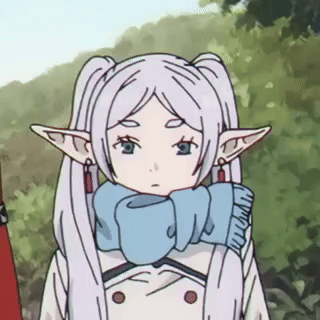

<h1 align="center">Hi, I'm Daniil.</h1>

I'm a beginner programmer. Student.

<h2 align="center">I'm learning</h2>

  

<h2 align="center">I'm learned</h2>

  
  

<!-- <h2 align="center">Contact</h2>

    <strong>Discord -</strong><em>@ekiari</em>  
    <strong>Telegram -</strong><em>@ekiari</em>

 -->

    

<!--<h2 align="center">My stats!</h2>

    
    

-->

    

<!--      -->
